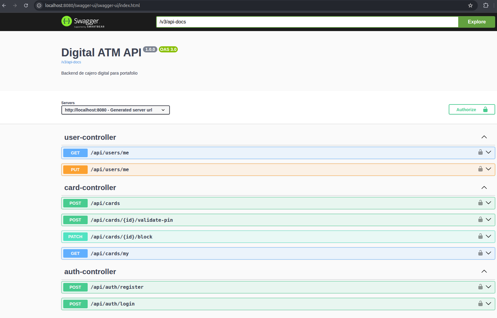

# digital-atm-backend

Backend para cajero digital / neobank API, diseñado para mostrar en portafolio. Este proyecto implementa un servicio REST seguro con gestión de usuarios, cuentas, tarjetas, transacciones y auditoría.

Clonar con SSH:

```bash
git clone git@github.com:VictorDG15/digital-atm-backend.git
```

## Descripción

Este backend expone una API de banca digital para operaciones comunes de un cajero automático y un neobank. Incluye:

- Autenticación y autorización con JWT
- Registro y gestión de usuarios
- Creación y consulta de cuentas bancarias
- Emisión, bloqueo y validación de tarjetas de débito
- Operaciones de depósito, retiro y transferencia
- Auditoría de transacciones y actividad de administrador
- Administración de usuarios, cuentas, transacciones y logs

## Tecnologías

- Java 21
- Spring Boot 3.3.5
- Maven
- Spring Web
- Spring Security + JWT
- Spring Data JPA
- PostgreSQL
- Flyway
- Swagger OpenAPI
- Docker Compose
- JUnit 5 + Mockito
- Lombok
- Validación con Bean Validation

## Funcionalidades principales

- Autenticación de usuarios y roles (`USER`, `ADMIN`)
- Registro de nuevos usuarios
- Gestión de perfiles de usuario
- Creación de cuentas bancarias con tipo y saldo inicial
- Consulta de saldo y cuentas propias
- Creación y bloqueo de tarjetas de débito
- Validación de PIN para operaciones de cajero
- Depósitos, retiros y transferencias con clave idempotencia
- Visualización de transacciones propias
- Panel administrativo para administrar usuarios, cuentas, transacciones y auditoría

## Cómo ejecutar el proyecto

1. Levantar la base de datos PostgreSQL:

```bash
docker compose up -d
```

2. Correr el backend:

```bash
mvn spring-boot:run
```

3. Acceder a Swagger UI:

```txt
http://localhost:8080/swagger-ui/index.html
```

## Evidencia de Swagger

La siguiente captura muestra el backend en ejecución y la documentación de la
API disponible desde Swagger UI:



## Configuración de base de datos

La configuración por defecto en `src/main/resources/application.yml` usa variables de entorno con valores de fallback:

```txt
DB: digital_atm
USER: digital_atm
PASSWORD: digital_atm
PORT: 5432
```

## Usuarios demo

```txt
ADMIN
username: admin
password: password

USER
username: yordi
password: password
PIN demo: 1234
Cuenta demo: 100000000001
Cuenta demo 2: 100000000002
```

## Endpoints principales

### Auth

```txt
POST /api/auth/register
POST /api/auth/login
```

### Usuarios

```txt
GET /api/users/me
PUT /api/users/me
GET /api/admin/users
```

### Cuentas

```txt
POST /api/accounts
GET /api/accounts/my
GET /api/accounts/{id}/balance
GET /api/admin/accounts
```

Crear cuenta:

```json
{
  "type": "SAVINGS",
  "initialBalance": 300.00
}
```

### Tarjetas

```txt
POST /api/cards
GET /api/cards/my
PATCH /api/cards/{id}/block
POST /api/cards/{id}/validate-pin
```

Crear tarjeta:

```json
{
  "accountId": 1,
  "pin": "1234"
}
```

### Cajero (ATM)

```txt
POST /api/atm/deposit
POST /api/atm/withdraw
POST /api/atm/transfer
GET /api/atm/transactions
```

Depósito:

```json
{
  "accountId": 1,
  "amount": 100.00,
  "idempotencyKey": "dep-001",
  "description": "Depósito desde cajero"
}
```

Retiro:

```json
{
  "accountId": 1,
  "cardId": 1,
  "pin": "1234",
  "amount": 50.00,
  "idempotencyKey": "wd-001",
  "description": "Retiro ATM"
}
```

Transferencia:

```json
{
  "sourceAccountId": 1,
  "cardId": 1,
  "pin": "1234",
  "targetAccountNumber": "100000000002",
  "amount": 75.00,
  "idempotencyKey": "trf-001",
  "description": "Transferencia demo"
}
```

### Administración

```txt
GET /api/admin/accounts
GET /api/admin/users
GET /api/admin/transactions
GET /api/admin/audit-logs
```

## Reglas incluidas

- JWT para endpoints privados.
- Roles USER y ADMIN.
- Password y PIN con BCrypt.
- Idempotency key en depósito, retiro y transferencia.
- Código único de transacción.
- Validación de saldo insuficiente.
- Validación de cuenta o tarjeta bloqueada.
- Bloqueo de cuenta al tercer PIN incorrecto.
- Auditoría de operaciones importantes.
- Manejo global de errores.

## Tests

```bash
mvn test
```

Incluye pruebas unitarias para AuthService, AccountService, TransactionService y ATMService.

## Postman

La colección está en:

```txt
postman/DigitalATM.postman_collection.json
```
